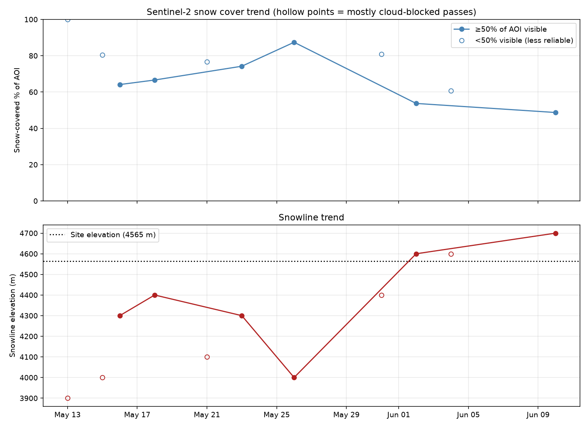
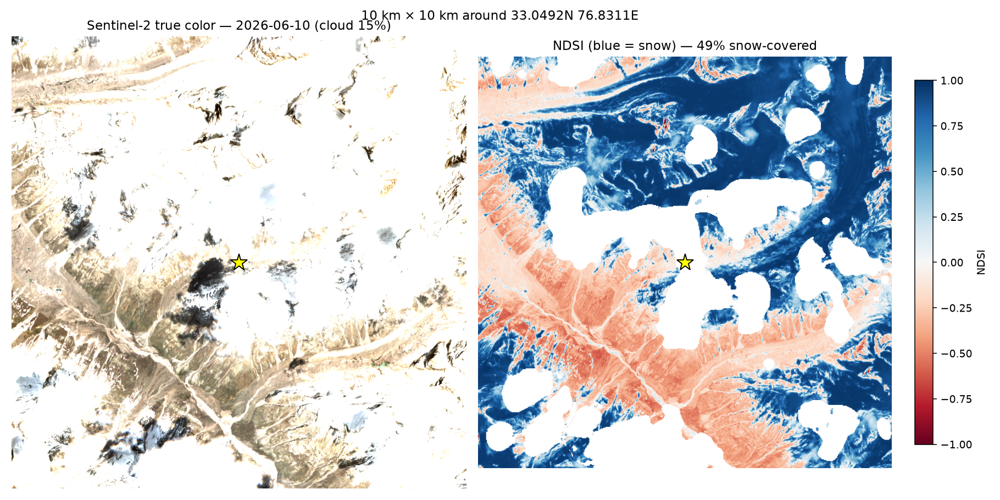
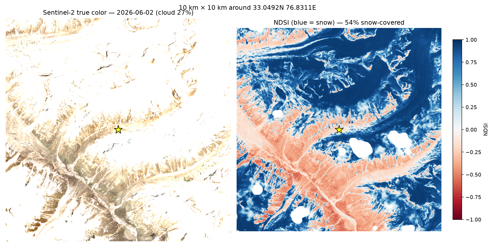
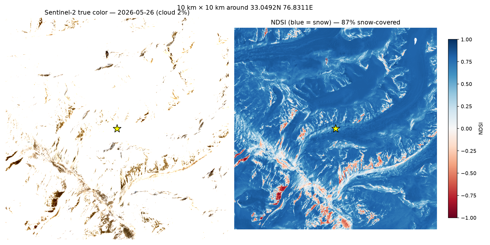
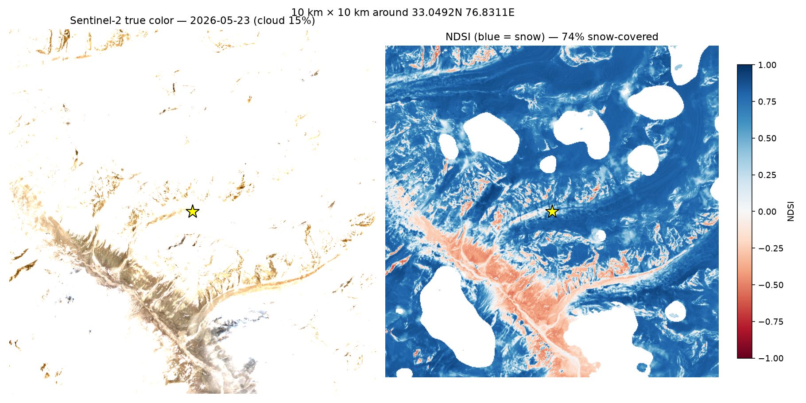
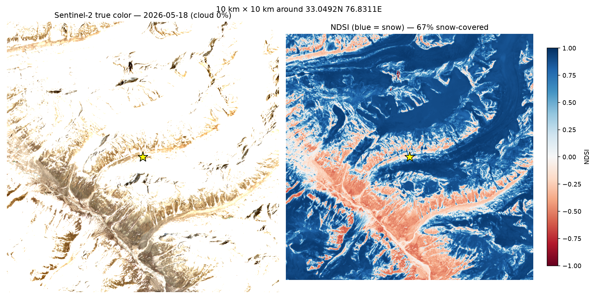
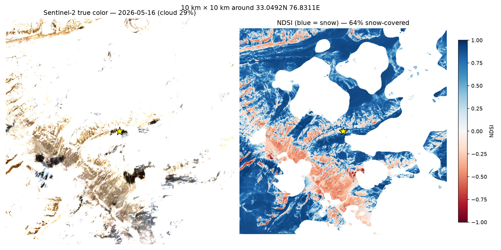
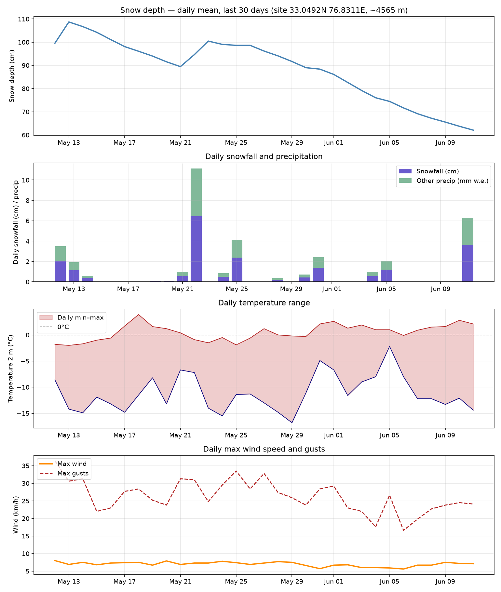
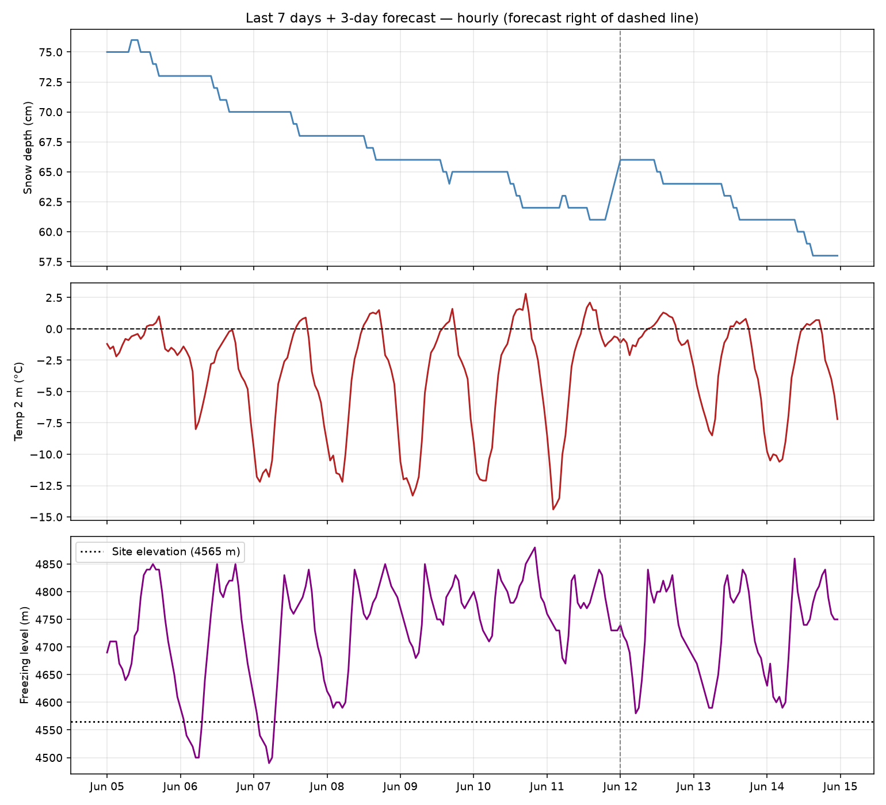
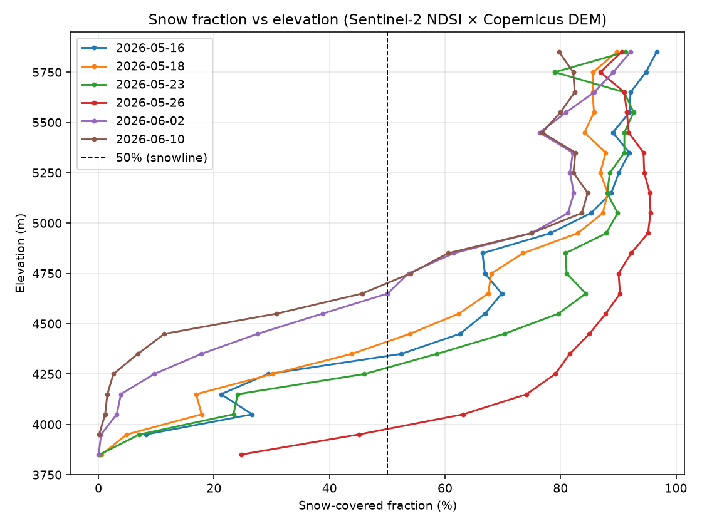

# Expedition Snow & Weather Report — 33.04917N, 76.83113E

*Generated 2026-06-11 23:59 IST. Site model elevation ≈ 4565 m (Pir Panjal / Bara Bhangal region, Himachal Pradesh).*

## Current snow state

- **Snow depth now: 65 cm** (30 days ago: 100 cm → net change -35 cm)
- **Fresh snowfall: 3.6 cm in last 24 h, 3.6 cm in last 72 h**
- Total snowfall over the past month: 21 cm
- Freezing level (last 3 days): 4670–4880 m (site is at ~4565 m)

## Satellite observations (Sentinel-2, 10 m)

| Date | Cloud % | Valid px % | Snow cover % | Snowline (m) | Snow at site |
|---|---|---|---|---|---|
| 2026-05-13 | 38 | 15 | 100 | 3900 | cloud |
| 2026-05-15 | 64 | 36 | 80 | 4000 | cloud |
| 2026-05-16 | 29 | 56 | 64 | 4300 | no |
| 2026-05-18 | 0 | 100 | 67 | 4400 | no |
| 2026-05-21 | 78 | 12 | 77 | 4100 | cloud |
| 2026-05-23 | 15 | 85 | 74 | 4300 | no |
| 2026-05-26 | 2 | 100 | 87 | 4000 | yes |
| 2026-05-31 | 76 | 8 | 81 | 4400 | cloud |
| 2026-06-02 | 27 | 97 | 54 | 4600 | no |
| 2026-06-04 | 63 | 18 | 61 | 4600 | cloud |
| 2026-06-05 | 81 | 0 | — | — | cloud |
| 2026-06-10 | 15 | 76 | 49 | 4700 | cloud |

*Snow cover % is over a 10×10 km box centered on the site, NDSI > 0.4, cloud-masked. Snowline = lowest 100 m elevation band with ≥50% snow.*

### Imagery (newest first — yellow star marks the site)

*Scenes where at least half the area was cloud-blocked are listed in the table above but not shown here; their PNGs are in `output/maps/`.*

**2026-06-10** — 49% snow-covered, cloud 15%

**2026-06-02** — 54% snow-covered, cloud 27%

**2026-05-26** — 87% snow-covered, cloud 2%

**2026-05-23** — 74% snow-covered, cloud 15%

**2026-05-18** — 67% snow-covered, cloud 0%

**2026-05-16** — 64% snow-covered, cloud 29%

## Month context

- Temperature range over the month: -16.8°C to 3.9°C
- Strongest gusts: 36 km/h
- 12 satellite passes in the month; 6 with <30% cloud

## Notes for the expedition

- Little fresh snow in the last 72 h (3.6 cm) — surface is likely consolidated spring snowpack.
- Freezing level is at/above the site: daytime melt and wet, heavy snow; overnight refreeze likely gives firm crust — start early, expect postholing by midday, and consider crampons for morning travel.
- Snowpack is in melt-out (35 cm lost over the month) — expect weakening snow bridges over streams/crevasses.
- Observed snowline is around **4700 m** in the latest clear scene — below that expect mostly bare ground, above it continuous snow.
- Model data is from Open-Meteo (~9 km grid, downscaled); treat absolute snow depth as indicative. Satellite snow extent is directly observed and more trustworthy for where snow is.

## Files

- `output/plots/month_overview.png` — snow depth, snowfall, temperature, wind (30 days)
- `output/plots/week_detail.png` — hourly last 7 days + 3-day forecast
- `output/plots/snowline_profile.png` — snow fraction vs elevation
- `output/maps/scene_<date>.png` — true color + NDSI snow maps
- `output/data/*.csv` — raw metrics
